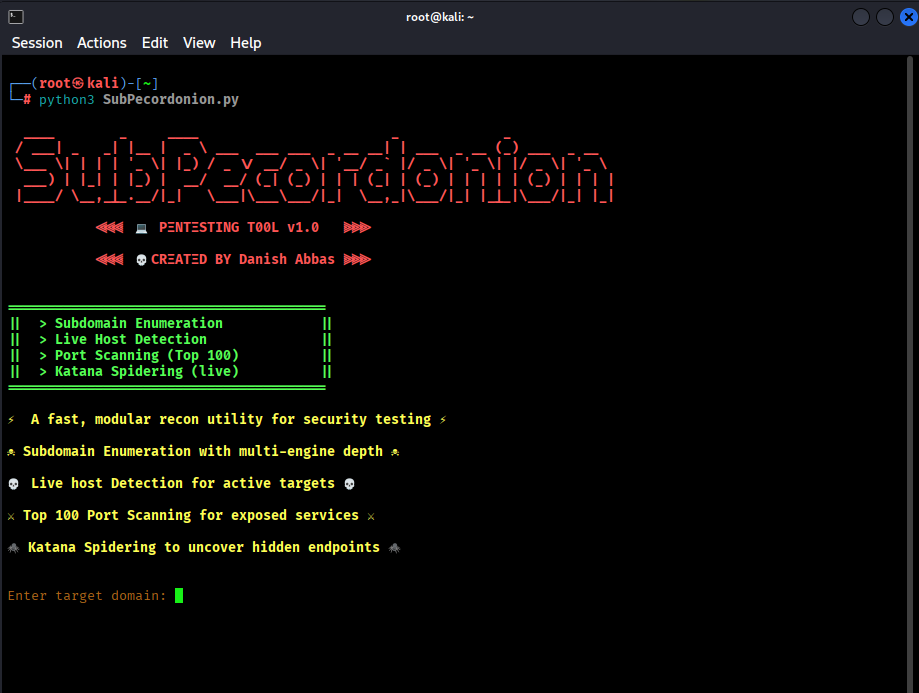
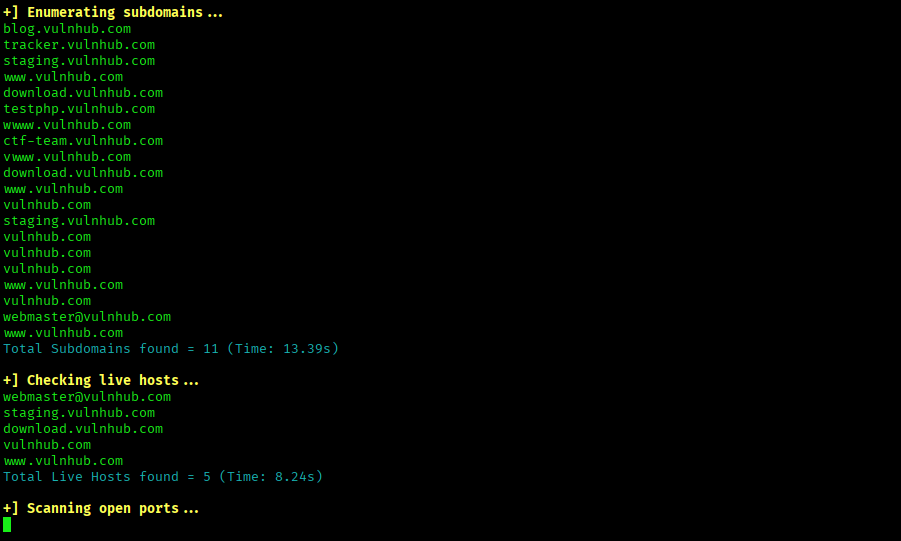
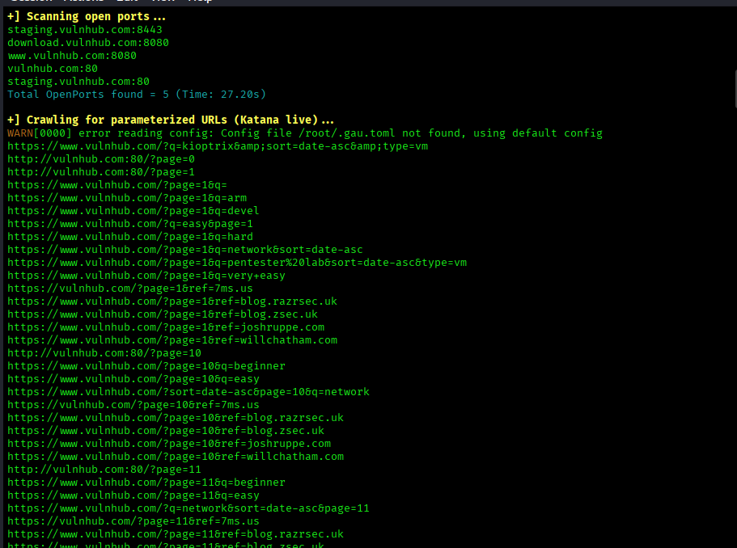

# 🧅 SubPecordonion  

⚡ **A fast, modular recon utility for security testing** ⚡  

☠ Subdomain Enumeration with multi-engine depth  
💀 Live Host Detection for active targets  
⚔ Top 100 Port Scanning for exposed services  
🕷 Katana Spidering to uncover hidden endpoints  

---

## 📖 Description  

**SubPecordonion** is a lightweight yet powerful reconnaissance tool designed for penetration testers, bug bounty hunters, and security researchers.  
It combines multiple recon techniques into a single modular script, helping you quickly map attack surfaces and uncover hidden assets.  

---

## ⚙️ Installation  

Clone the repository and navigate into the project directory:  

```bash
git clone https://github.com/yourusername/SubPecordonion.git
cd SubPecordonion

📦 Requirements
- Python 3.x
- Required libraries (install via pip):

🚀 Usage
Run the script with:
python3 SubPecordonion.py

🖼 Example
Below are some example screenshots of SubPecordonion in action:








🛡 Disclaimer
This tool is intended for educational and authorized security testing purposes only.
The author is not responsible for any misuse or damage caused by this program.


